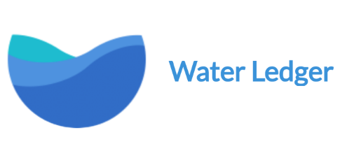

  

*Transparent water trading using Ethereum blockchain technology.* 

**Water Ledger is a work in progress, contracts not to be used in production**

## Smart Contracts

### Water Token

The water token contract represents a Government issued right to use an allocated amount of water. 

- Is an ERC-20 token 
- Can be allocated (minted) by an allocator stakeholder
- Can be transferred by the order book (on completed order)

### AUD Token

The AUD token contract is an Australian dollar backed dollar to be used to exchange water allocation rights.

- Is an ERC-20 token
- Can be minted by the token owner
- Can be burnt by the token owner
- Can be transferred by the order book (on completed order)

### Order Book

The Order Book contract maintains the current orders and matches buyer & seller orders.

- Can place a buy limit order (buy water allocation for AUD)
- Can place a sell limit order (sell water allocation for AUD)
- Can query current orders

### Stats

The Stats contract records key statistics for reporting.

- Records volume available
- Records in transit amount
- Records average bid
- Records min bid
- Records max bid

---

*Developed by* [Civic Ledger Pty Ltd](https://www.civicledger.com/)
